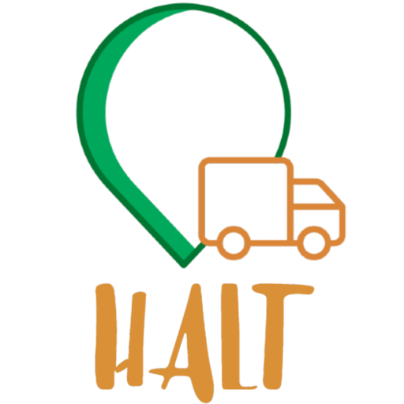
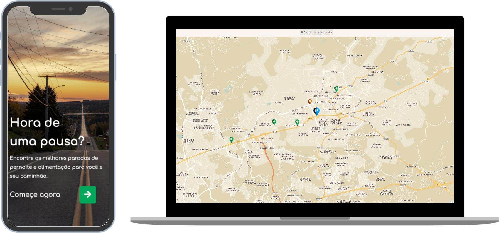

<p align="center">
    <a href="https://halt-app.herokuapp.com/"><a/>
</p>
    <h1 align="center">Halt</h1>

<h4 align="center">
Encontre as melhores paradas de pernoite e alimentação para você e seu caminhão.
</h4>
<p align="center">
  

  
  
  <a href="https://github.com/KZTN/Halt/commits/master">
    
  </a>

  <a href="https://github.com/KZTN/Halt/issues">
    
  </a>

  
</p>
<p align="center">
  
</p>


## ⚠️ Atenção

 Este é um projeto com a iniciativa do hackathon da Shawee patrocinado pela [CCR](http://www.grupoccr.com.br/hackathonccr/).  Todo o protótipo está funcional e pronto para uso.

## 💻 Projeto

O Halt é uma plataforma que visa conectar caminhoneiros a pontos de locação e pousada com o âmbito de promoter o bem estar social e de vida dos seus usuários.
## Começando...
Essas instruções fornecerão uma cópia do projeto em execução na sua máquina local para fins de desenvolvimento e teste.

### Pré-requisitos
O que você precisa para instalar o software:

```
node v12.x
yarn 1.22.4
git
```

### Instalando o projeto 🚀
Clonando o projeto:

```
git clone https://github.com/KZTN/Halt.git
```

Navegando até a pasta do projeto:

```
cd Halt
```

Crie um arquivo `.env` na raíz do projeto e adicione as seguintes linhas:

```bash
REACT_APP_GOOGLE_KEY= YOUR_GOOGLE_API_HERE
REACT_APP_API_URL= https://halt-server.herokuapp.com/
```
> Para obter sua própria API da google, acesse: https://console.cloud.google.com/ (Recurso não obrigatório)

Baixando as dependências do projeto:

```bash
yarn install
```

Rodando o projeto:

```bash
yarn start
```


Visite http://localhost:3000 com o seu navegador para ver o resultado. 🎉


## :memo: Licença

Esse projeto está sob a licença MIT. Veja o arquivo [LICENSE](LICENSE.md) para mais detalhes.
